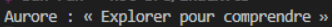
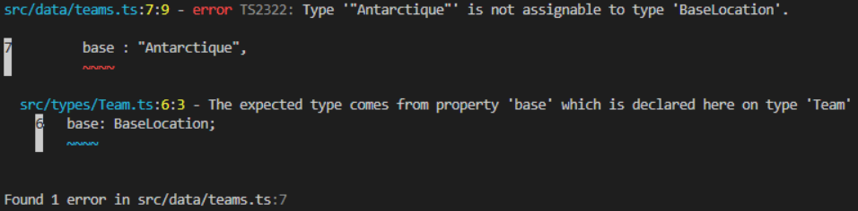

# web

To install dependencies:

```bash
bun install
```

To run:

```bash
bun run index.ts
```

This project was created using `bun init` in bun v1.4.2. [Bun](https://bun.com) is a fast all-in-one JavaScript runtime.


# Conducteur du TD

## 1.1 : Création du type BaseLocation et du type Team
## 1.2 : Création des données de teams
## 1.3 : Destructuration et affichage de l'objet TS

Affichage de la première team de la liste :


Vérifications : 
- Lorsqu'une propriété inexistante est utilisée : 
```typescript
export const teams: Array<Team> = [
    {
        id : 1,
        name : "Aurore",
        base : "Antartique",
        title : "Explorer pour comprendre",
        memberCount : 120
    },
```
Résultat : 

## 2.1 : Création des types Status, CrewMember et définition des données crewMembers.ts
## 2.2 : Déclaration des fonctions fléchées
## 2.3 : Recherche de valeurs et affichage en utilisant les fonctions de la partie précédente
Contrôle de la partie 2 : 
- Bon affichage pour Alonzo Church
- 4 membres sont bien disponibles
- 3 membres ont bien la compétence 'communication'

Observations de l'exercice 2 : 
1. `filter` décrit les propriétés du résultat attendu.
2. la fonction sert de callback à la fonction `filter`.
3. Elles produisent une nouvelle valeur.

## 3.1 Fonction `findTeamById`
## 3.2 Fonction `getTeamName`
## 3.3 Tranformation des données

Observations de l'exercice 3 : 
1. Toutes les fonctions de cette partie (`findTeamById`, `getTeamName` et `createCrewCards`) calculent et retournent une valeur.
2. L'instruction `console.table(crewCards)`, qui produit un effet de bord (effet observable) en affichant les données sur la console.
3. Oui, ces fonctions sont déterministes : pour des données d'entrée identiques (`teams` et `crewMembers`), elles produisent toujours les mêmes résultats.

## 4.1 Étendre le modèle
## 4.2 Ajouter une collaboration à une équipe
## 4.3 Mettre à jour le tableau complet
## 4.4 Supprimer une collaboration

Observations de l'exercice 4 :
1. En TypeScript, l'opérateur `!==` compare l'égalité par référence en mémoire et non par valeur. `updatedAurore` est une nouvelle instance créée en mémoire (via `{ ...team }`) pour préserver l'immuabilité de l'original, donc leurs adresses mémoires sont distinctes.
2. Seule l'équipe modifiée (`team.id === teamId`) obtient une nouvelle référence (créée par `addPartner`). Toutes les autres équipes conservent leur référence mémoire d'origine. Le tableau retourné est lui aussi une nouvelle référence générée par `.map()`.
3. L'absence de mutation permet une comparaison par référence en (`ancienEtat === nouvelEtat`) sans devoir comparer récursivement toutes les propriétés en profondeur. L'ancien état reste également intact et disponible pour l'historique ou la détection de changements.
4. Cela engendrerait des effets de bord : une modification directe change les données utilisées par l'autre partie sans notification, risquant d'entraîner des corruptions de données, des incohérences d'affichage et des bugs.

## 5.1 Créer une union discriminée


